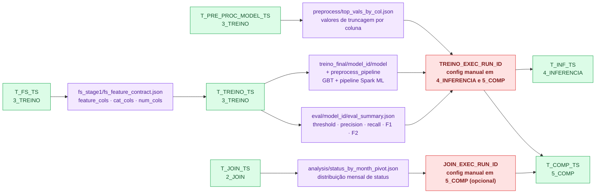

# ISA_DEV — Pipeline Flowcharts (MODE_C)

Documentação visual do pipeline ISA_DEV. Notebooks cobertos: `0_INGESTAO`, `1_PRE_PROC`, `2_JOIN`, `3_TREINO_MODE_C`, `4_INFERENCIA_MODE_C`, `5_COMP_MODE_C`.

Renderizar em: **Mermaid Live Editor** (mermaid.live) ou extensão VSCode com suporte Mermaid.

> Convenção de nomes: `_TS` = `TS_EXEC` (timestamp de execução), `_UUID` = 8 chars hex por treino, `_SEG` = slug do segmento alvo.

---

## Legenda de Cores e Shapes

| Elemento | Shape | Cor |
|---|---|---|
| Tabela Delta | Cilindro `[(nome)]` | Azul |
| Bloco de processamento | Retângulo `[nome]` | Verde claro |
| Bloco de regras/transforms | Retângulo `[nome]` | Amarelo |
| Pipeline Spark ML | Retângulo `[nome]` | Azul claro |
| MLflow parent run | Hexágono `{{nome}}` | Âmbar |
| MLflow container run | Retângulo arredondado `(nome)` | Azul claro |
| MLflow exec run | Retângulo `[nome]` | Verde claro |
| Artefato MLflow | Retângulo `[nome]` | Roxo claro |
| Bridge de referência manual | Retângulo `[nome]` | Vermelho claro |

---

## Diagrama A — Visão Geral do Pipeline

Notebooks como contêineres, blocos de processamento internos e tabelas Delta que conectam as etapas.

```mermaid
flowchart LR
    classDef delta fill:#dbeafe,stroke:#3b82f6,color:#1e3a5f,font-weight:bold
    classDef rules fill:#fef3c7,stroke:#d97706,color:#78350f
    classDef step fill:#f0fdf4,stroke:#16a34a,color:#14532d

    subgraph NB0["0_INGESTAO"]
        direction TB
        n0a["Listagem SFTP\nfiltro por file_regex"]:::step
        n0b["Ingestão CSV\nISO-8859-1 · pipe-delimited\nTS_ARQ · SOURCE_FILE"]:::step
        n0c["Cópia tabelas corretor\nse REFRESH_CORRETOR_TABLES=True"]:::step
        n0a --> n0b --> n0c
    end

    t_bcot[(bronze.cotacao_generico_TS)]:::delta
    t_bres[(bronze.corretor_resumo)]:::delta
    t_bdet[(bronze.corretor_detalhe)]:::delta

    n0b --> t_bcot
    n0c --> t_bres
    n0c --> t_bdet

    subgraph NB1["1_PRE_PROC"]
        direction TB
        n1a["Carga bronze"]:::step
        n1b["RULES_BY_TABLE: cotacao_generico\nGEN_R01–R12\nlabel · canal · status · temporal"]:::rules
        n1c["RULES_BY_TABLE: corretor_resumo\nRES_R01–R08\ndedup · tipos · normalização"]:::rules
        n1d["RULES_BY_TABLE: corretor_detalhe\nDET_R01–R03\nnormalização · casting"]:::rules
        n1e["Escrita silver\n+ profiling · rules_catalog"]:::step
        n1a --> n1b --> n1c --> n1d --> n1e
    end

    t_bcot --> n1a
    t_bres --> n1a
    t_bdet --> n1a

    t_sgen[(silver.cotacao_generico_clean_TS)]:::delta
    t_sres[(silver.corretor_resumo_clean_TS)]:::delta
    t_sdet[(silver.corretor_detalhe_clean_TS)]:::delta

    n1e --> t_sgen
    n1e --> t_sres
    n1e --> t_sdet

    subgraph NB2["2_JOIN"]
        direction TB
        n2a["Carga silver"]:::step
        n2b["Transforms JOIN\nJOIN_R01: cotacao LEFT JOIN corretor_resumo\nJOIN_R02: resultado LEFT JOIN corretor_detalhe"]:::rules
        n2c["Transforms SEG\nSEG_R01: criar coluna SEG\nSEG_R02: drop CANAL, DS_TIPO_COTACAO"]:::rules
        n2d["Escrita silver\n+ profiling · seg_counts · análise mensal"]:::step
        n2a --> n2b --> n2c --> n2d
    end

    t_sgen --> n2a
    t_sres --> n2a
    t_sdet --> n2a

    t_seg[(silver.cotacao_seg_TS)]:::delta
    n2d --> t_seg

    subgraph NB3["3_TREINO_MODE_C"]
        direction TB
        n3ppm["T_PRE_PROC_MODEL\nRULES_BY_BLOCK: rules_on_df_seg · rules_build_base\n  rules_build_df_model · rules_build_df_validacao · rules_feature_prep\nSplit: xxhash64 determinístico por ID · SEG · MES · SALT\nFeature prep: nulls · cardinalidade · constantes\n→ gold.cotacao_model / gold.cotacao_validacao"]:::rules
        n3fs["T_FEATURE_SELECTION\nDetecção cat / num por schema + toggles\nLoop multi-seed: 42 · 123 · 7\nMétodos: LR-L1 · RandomForest · GBTClassifier\nEnsemble ponderado por avg_AUC-PR\nAnálises: Mutual Information · Pearson"]:::step
        n3t["T_TREINO\nGrid: maxDepth × stepSize → model_ids\nCV 2-fold por combo\nTreino final de todos os combos\nAvaliação no df_validacao:\n  PR curve · threshold · eval_summary"]:::step
        n3ppm --> n3fs --> n3t
    end

    t_seg --> n3ppm

    t_model[(gold.cotacao_model_TS_UUID)]:::delta
    t_valid[(gold.cotacao_validacao_TS_UUID)]:::delta

    n3ppm --> t_model
    n3ppm --> t_valid

    subgraph NB4["4_INFERENCIA_MODE_C"]
        direction TB
        n4a["Carga gold.cotacao_validacao\nfiltro SEG_TARGET"]:::step
        n4b["Pré-processamento\nblanks→null · cast numeric\ntruncagem via top_vals_by_col"]:::step
        n4c["Loop por model_id\ncarregar preprocess_pipeline + GBT\nextrair p_emitida · rank_global"]:::step
        n4d["Adição de metadados\ntreino_exec_run_id · inf_versao\nmode_code · seg_inferida · inference_ts"]:::step
        n4e["Escrita wide table\n1 linha por cotação · N colunas por model_id"]:::step
        n4a --> n4b --> n4c --> n4d --> n4e
    end

    t_valid --> n4a

    t_inf[(gold.cotacao_inferencia_mode_c_SEG_TS)]:::delta
    n4e --> t_inf

    subgraph NB5["5_COMP_MODE_C"]
        direction TB
        n5a["Bloco 1: Ranking\nP@K% · R@K% · Lift@K%\ncurvas por model_id"]:::step
        n5b["Bloco 2: Classificação\nAUC-PR · AP\ncurvas precision-recall"]:::step
        n5c["Bloco 2b: Threshold metrics\nP · R · F1 · F2 vs threshold τ"]:::step
        n5d["Bloco 2c: Overfitting\ntreino vs. validação por modelo"]:::step
        n5e["Blocos 3–5\nScore dist. · Concordância de rankings · Estabilidade temporal"]:::step
        n5f["Bloco 6: Tabela de seleção\nauc_pr · ap · P@K_ref% por model_id"]:::step
        n5a --> n5b --> n5c --> n5d --> n5e --> n5f
    end

    t_inf --> n5a
```

---

## Diagrama B — Hierarquia de Runs MLflow

Estrutura de rastreamento de cada etapa. Todas as `exec` runs recebem as tags: `pipeline_tipo`, `stage/etapa`, `run_role`, `mode`, `versao`, `seg_target`.

```mermaid
flowchart TD
    classDef pr fill:#fde68a,stroke:#d97706,color:#78350f,font-weight:bold
    classDef container fill:#e0f2fe,stroke:#0284c7,color:#0c4a6e
    classDef exec fill:#dcfce7,stroke:#16a34a,color:#14532d

    subgraph H0["0_INGESTAO"]
        direction TB
        pr0{{T_PR_INGESTAO}}:::pr
        ex0["T_INGESTAO_TS\nrun_role=child · etapa=INGESTAO\nmode=INCREMENTAL_SFTP|REPLAY|COPY\nparams: n_arquivos, n_linhas\nartifacts: profiling.json · cfg_ingestao.json"]:::exec
        pr0 --> ex0
    end

    subgraph H1["1_PRE_PROC"]
        direction TB
        pr1{{T_PR_PRE_PROC}}:::pr
        ex1["T_PRE_PROC_TS\nrun_role=child · etapa=PRE_PROC\nparams: bronze_fact_fqn, enable_rules\nartifacts: rules_catalog.json · profiling.json"]:::exec
        pr1 --> ex1
    end

    subgraph H2["2_JOIN"]
        direction TB
        pr2{{T_PR_JOIN}}:::pr
        ex2["T_JOIN_TS\nrun_role=child · etapa=JOIN\nparams: silver_*_fqn, seg_table_fqn\nartifacts: seg_counts.json · status_by_month_*.png"]:::exec
        pr2 --> ex2
    end

    subgraph H3["3_TREINO_MODE_C"]
        direction TB
        pr3{{T_PR_TREINO}}:::pr
        mode_c("T_MODE_C\nrun_role=container · mode=C"):::container

        cont_ppm("T_PRE_PROC_MODEL\nrun_role=container"):::container
        ex_ppm["T_PRE_PROC_MODEL_TS\nrun_role=exec · step=PRE_PROC_MODEL\nparams: seg_target · valid_frac · split_salt\nmetrics: n_seg_in · n_df_model · n_df_validacao\nartifacts: preprocess/top_vals_by_col.json"]:::exec

        cont_fs("T_FEATURE_SELECTION\nrun_role=container"):::container
        ex_fs["T_FS_TS\nrun_role=exec · step=FEATURE_SELECTION\nparams: fs_seeds · fs_methods_config\nmetrics: method_avg_ap_val · n_features_candidate\nartifacts: fs_stage1/fs_feature_contract.json"]:::exec

        cont_t("T_TREINO\nrun_role=container"):::container
        ex_t["T_TREINO_TS\nrun_role=exec · step=TREINO\nparams: feature_cols · model_ids · eval_criterion\nmetrics: cv_combo_avg_auc_pr · eval_model_precision\nartifacts: treino_final/model_id/model"]:::exec

        pr3 --> mode_c
        mode_c --> cont_ppm --> ex_ppm
        mode_c --> cont_fs --> ex_fs
        mode_c --> cont_t --> ex_t
    end

    subgraph H4["4_INFERENCIA_MODE_C"]
        direction TB
        pr4{{T_PR_INFERENCIA}}:::pr
        ex4["T_INF_TS\nrun_role=exec · stage=INFERENCIA · mode=C\nparams: treino_exec_run_id · model_ids\nmetrics: n_rows_output · n_models_scored\nartifacts: score_profile_per_model.json"]:::exec
        pr4 --> ex4
    end

    subgraph H5["5_COMP_MODE_C"]
        direction TB
        pr5{{T_PR_COMP}}:::pr
        ex5["T_COMP_TS\nrun_role=exec · stage=COMP · mode=C\nparams: treino_exec_run_id · join_exec_run_id\nmetrics: ap_model · auc_pr_model\nartifacts: ranking/topk_curves.csv · summary/model_selection_table.csv"]:::exec
        pr5 --> ex5
    end
```

> **Nota:** `PR_RUN_ID_OVERRIDE` e `MODE_RUN_ID_OVERRIDE` permitem reutilizar runs parent/container existentes sem criar novos contêineres a cada execução.

---

## Diagrama C — Dependências de Artefatos Cross-Notebook

Artefatos MLflow que cruzam fronteiras de notebooks. As pontes `TREINO_EXEC_RUN_ID` e `JOIN_EXEC_RUN_ID` são preenchidas manualmente na célula de Config do notebook downstream.

---

## Diagrama D — 3_TREINO_MODE_C: Estrutura Interna

Detalhe das três sub-etapas do notebook de treinamento.

```mermaid
flowchart TD
    classDef rules fill:#fef3c7,stroke:#d97706,color:#78350f
    classDef ml fill:#e0f2fe,stroke:#0284c7,color:#0c4a6e
    classDef data fill:#dbeafe,stroke:#3b82f6,color:#1e3a5f,font-weight:bold
    classDef artifact fill:#f3e8ff,stroke:#7c3aed,color:#4c1d95

    t_seg_in[(silver.cotacao_seg_TS)]:::data

    subgraph PPM["T_PRE_PROC_MODEL  [MLflow: T_PRE_PROC_MODEL_TS]"]
        direction TB
        ppm1["Carga silver.cotacao_seg"]
        ppm2["rules_on_df_seg\nPP_R01: normalizar DS_GRUPO_STATUS\nPP_R02: filtrar status finais (Emitida · Perdida)\nPP_R03: criar label (1.0 / 0.0)\nPP_R07: excluir meses configurados"]:::rules
        ppm3["rules_build_base\nBUILD_R01: criar coluna MES (yyyy-MM)\nBUILD_R02: split determinístico\n  xxhash64(ID_COL, SEG_COL, MES, SPLIT_SALT) % 100 < valid_frac*100\n  → coluna is_valid"]:::rules
        ppm4a["rules_build_df_model\nMODEL_R03: filtrar is_valid=False\nBUILD_R04: drop colunas auxiliares"]:::rules
        ppm4b["rules_build_df_validacao\nVALID_R03: filtrar is_valid=True\nBUILD_R04: drop colunas auxiliares"]:::rules
        ppm5["rules_feature_prep (aplicado antes da escrita)\nPP_R04: drop features com mais de 90% nulos\nPP_R05: truncar alta cardinalidade → top_10 + OUTROS\nPP_R06: remover features constantes (cardinalidade <= 1)"]:::rules
        ppm6["Escrita gold\ngold.cotacao_model_TS_UUID\ngold.cotacao_validacao_TS_UUID"]
        ppm1 --> ppm2 --> ppm3 --> ppm4a & ppm4b --> ppm5 --> ppm6
    end

    t_seg_in --> ppm1

    t_model[(gold.cotacao_model_TS_UUID)]:::data
    t_valid[(gold.cotacao_validacao_TS_UUID)]:::data
    art_topvals["preprocess/top_vals_by_col.json\n→ 4_INFERENCIA via TREINO_EXEC_RUN_ID"]:::artifact

    ppm6 --> t_model
    ppm6 --> t_valid
    ppm6 --> art_topvals

    subgraph FS["T_FEATURE_SELECTION  [MLflow: T_FS_TS]"]
        direction TB
        fs1["Carga gold.cotacao_model\nfiltro SEG_TARGET · blanks→null · cast numeric"]
        fs2["Detecção de tipos\ncat: StringType + FEATURE_CANDIDATES toggles\nnum: NumericType + FEATURE_CANDIDATES toggles\n→ candidatos excluindo ID · label · SEG · MES"]
        fs3["Loop multi-seed (42 · 123 · 7)\nPor seed:\n  Split estratificado 70 train / 30 val\n  Pipeline Spark ML:\n    StringIndexer → OneHotEncoder\n    → Imputer (mean) → VectorAssembler"]:::ml
        fs4["Treino e avaliação por seed × método:\n  LR-L1  (C=0.01, maxIter=100)\n  RandomForest  (numTrees=100, maxDepth=5)\n  GBTClassifier  (maxIter=100)\n→ AP e AUC-PR por método/seed\n→ importâncias normalizadas por rank"]:::ml
        fs5["Ensemble ponderado\npeso_método = avg_AUC-PR normalizado\nranking final de features por ensemble\n→ topk_sets: top_5, top_10…"]
        fs6["Análises complementares (paralelas)\nMutual Information (sklearn, numeric+cat)\nPearson correlation matrix (numeric)"]
        fs1 --> fs2 --> fs3 --> fs4 --> fs5 --> fs6
    end

    t_model --> fs1

    art_contract["fs_stage1/fs_feature_contract.json\nfeature_cols · treino_cat_cols · treino_num_cols\n→ consumido por T_TREINO na mesma execução"]:::artifact
    fs5 --> art_contract

    subgraph TR["T_TREINO  [MLflow: T_TREINO_TS]"]
        direction TB
        tr1["Carga gold.cotacao_model\nfiltro SEG_TARGET · blanks→null · cast numeric\nclass_weight = (1-label_rate)/label_rate se label_rate < 0.30"]
        tr2["Grid de hiperparâmetros\nGBTClassifier:\n  maxDepth: 4, 6\n  stepSize: 0.1\n  maxIter: 100  (fixo)\n  seed: 42  (fixo)\n→ model_ids: d4_s01 · d6_s01 …"]
        tr3["Cross-validation 2-fold (determinística)\nPor combo × fold:\n  fit preprocessor (StringIndexer+OHE+Imputer+VectorAssembler)\n  fit GBTClassifier\n  métrica de seleção: AUC-PR\n→ cv_combo_fold_auc_pr · cv_combo_avg_auc_pr"]:::ml
        tr4["Treinamento final (todos os combos, sem seleção de vencedor)\nfit preprocessor em df_model completo\nfit GBT com class_weight (se apply_cw=True)\nsalvar no MLflow:\n  treino_final/model_id/model\n  treino_final/model_id/preprocess_pipeline\n→ auc_pr_treino_model_id · ap_treino_model_id"]:::ml
        tr5["Avaliação no df_validacao\nPR curve por threshold 0.01 a 0.99\nSelecionar threshold τ por critério:\n  max_f1 | max_f2 | precision_ge_target\nLogar por model_id:\n  eval_summary.json · pr_curve.png\n  threshold_metrics.png · confusion_matrix.png"]
        tr1 --> tr2 --> tr3 --> tr4 --> tr5
    end

    art_contract --> tr1
    t_model --> tr1

    art_model["treino_final/model_id/model\n+ treino_final/model_id/preprocess_pipeline\n→ 4_INFERENCIA via TREINO_EXEC_RUN_ID"]:::artifact
    art_eval_sum["eval/model_id/eval_summary.json\n→ 5_COMP via TREINO_EXEC_RUN_ID (opcional)"]:::artifact

    tr4 --> art_model
    tr5 --> art_eval_sum
```

